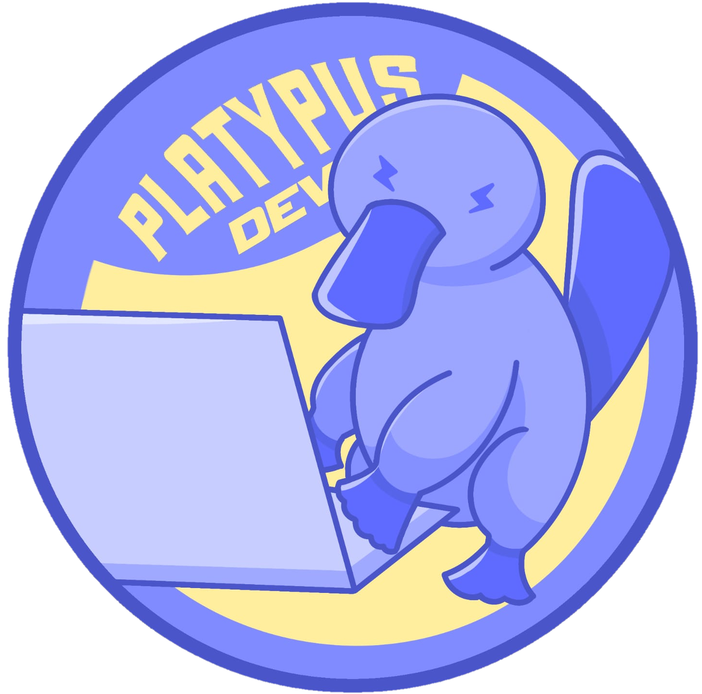

# <div align="center"> DM - Landing Page de Captação e Pré-Qualificação de Clientes </div>

<br>

<div align="center">
      
      <h2 align="center"> Platypus Dev</h2>
</div>

<br>

> **Status:** 🟨 Em andamento
> 
> **Etapa:** Sprint 1

<br>

## **🚀 API 2º Semestre**

  Projeto acadêmico desenvolvido por alunos do 2º Semestre de Análise e Desenvolvimento de Sistemas com o objetivo de fazer uma Landing Page para captação e pré-qualificação de clientes interessados nos cartões oferecidos pela empresa DM Financeira.

## **🏅 Desafio**

  O desafio propõe desenvolver uma Landing Page de Captação e Pré-Qualificação de Clientes, com uma experiência simples e intuitiva. O sistema deve aplicar corretamente as regras de aprovação, reprovação e seleção de lojas, considerando o tipo de cliente, cartão solicitado e restrições geográficas. O escopo do projeto está concentrado na captação do cliente, não incluindo o envio do cartão ou etapas posteriores da jornada.

## 📋 Metodologia

  O projeto utiliza a metodologia ágil Scrum para organizar e acompanhar o desenvolvimento. O trabalho é dividido em Sprints, nas quais a equipe planeja, desenvolve e acompanha as tarefas do projeto a partir do Product Backlog. Essa abordagem permite acompanhar o progresso, priorizar funcionalidades e realizar ajustes ao longo do desenvolvimento, mantendo a equipe alinhada com os objetivos do projeto.

---

## **🗂️ Backlog do produto**

| Rank | ID | User story | Prioridade | Estimativa | Sprint | Status |
| ---- | -- | ---------- | ---------- | -----------| ------ | ------ |
| 1 | US01 | Como visitante, quero acessar uma landing page simples e intuitiva para solicitar meu cartão, para iniciar o processo de contratação sem dificuldades. | Alta | 5 | 1 | |
| 2 | US02 | Como cliente, quero preencher meus dados na landing page, para que minha solicitação possa ser pré-qualificada. | Alta | 8 | 1 |
| 3 | US03 | Como cliente, quero visualizar o status da minha solicitação após a pré-qualificação, para entender se posso prosseguir ou se minha solicitação permanecerá em análise. | Média | 2 | 1 | |
| 4 | US04 | Como cliente pré-qualificado, quero ser encaminhado automaticamente para a etapa de seleção de loja e tipo de cartão, para dar continuidade ao meu processo de contratação. | Baixa | 5 | 1 | |
| 5 | US05 | Como cliente, quero visualizar apenas as lojas parceiras disponíveis no meu estado, para selecionar uma loja compatível com meu CEP. | Alta | 3 | 1 | |
| 6 | US06 | Como cliente, quero visualizar os cartões disponíveis para a loja selecionada, para escolher uma opção compatível com o estabelecimento. | Média | 3 | 1 | |
| 7 | US08 | Como atendente DM, quero visualizar o status e as informações da solicitação do cliente, para orientá-lo em caso de dúvidas sobre seu processo. | Média | 5 | 2 | |
| 8 | US09 | Como atendente DM, quero enviar mensagens ao cliente pela plataforma, para orientá-lo sem depender dos canais externos de atendimento. | Média | 8 | 2 | |
| 9 | US10 | Como equipe DM, quero visualizar indicadores das solicitações de cartões, para acompanhar os resultados da captação de clientes. | Alta | 5 | 2 | |
| 10 | US07 | Como cliente que não foi aprovado para um cartão, quero visualizar outros produtos disponíveis, para conhecer alternativas que possam atender às minhas necessidades. | Baixa | 5 | 3 | |

## **🟢 DoR - Definition of Ready**

Uma User Story é considerada pronta para ser desenvolvida quando:

* Possui critérios de aceitação definidos.
* Possui subtarefas devidamente divididas.
* A equipe possui entendimento claro dos objetivos e das tarefas.
* As regras de negócio relacionadas estão compreendidas.
* Os requisitos necessários para o desenvolvimento estão disponíveis.

## **✅ DoD - Definition of Done**

Uma User Story é considerada concluída quando:

* O protótipo no Figma foi desenvolvido, quando aplicável.
* A modelagem do banco de dados foi realizada, quando necessária.
* O código foi implementado.
* O código está organizado e versionado no GitHub.
* Os critérios de aceitação foram atendidos.
* Foram realizados testes manuais.
* A documentação correspondente foi atualizada, quando aplicável.

## **📆 Cronograma das Sprints**

| Sprint | Período | MVP | Link para Documentação | Link para Vídeo no Youtube do Incremento Entregue |
| ----------- | ----------- | ----------- | ----------- | ----------- |
| 1 | 07/09/2026 a 27/09/2026 | [Sprint 1](./mvp/sprint-01/README.md) | <h4 align="center"> <a href="https://platypusdev.atlassian.net/jira/software/projects/SCRUM/boards/1/backlog?atlOrigin=eyJpIjoiMmZmMjFhMzQwNzhlNDAxYzkwMTJlMGUyZDM2MGFhYmYiLCJwIjoiaiJ9"></a>  </h4> | <h4 align="center"> <a href="https://www.youtube.com/watch?v=lfSPUP1fqwk"></a>  </h4> |
| 2 | 05/10/2026 a 25/10/2026 | [Sprint 2](./mvp/sprint-02/README.md) | <h4 align="center"> <a href=""></a>  </h4>  | <h4 align="center"> <a href=""></a>  </h4> |
| 3 | 02/11/2026 a 22/11/2026 |  [Sprint 3](./mvp/sprint-03/README.md) | <h4 align="center"> <a href= ""></a>  </h4> | <h4 align="center"> <a href=""></a>  </h4> |

## **🔧 Tecnologias utilizadas**

<div align="center">
  <a href="https://www.figma.com/"></a>
  <a href="https://developer.mozilla.org/pt-BR/docs/Web/HTML"></a>
  <a href="https://developer.mozilla.org/pt-BR/docs/Web/CSS"></a>
  <a href="https://developer.mozilla.org/pt-BR/docs/Web/JavaScript"></a>
  <a href="https://www.typescriptlang.org/"></a>
  <a href="https://www.python.org/"></a>
  <a href="https://www.mysql.com/"></a>
  <a href="https://www.docker.com/"></a>
  <a href="https://git-scm.com/"></a>
  <a href="https://www.atlassian.com/software/jira"></a>
  <a href="https://github.com/"></a>
</div>

## **🧱 Estrutura do projeto**

O projeto está organizado em diretórios que separam o código-fonte, os scripts do banco de dados, a documentação e os arquivos de configuração. Essa organização facilita a manutenção, o versionamento e o trabalho colaborativo da equipe.

```text
DM-LandingPage/
│
├── database/
│   ├── init/
│   ├── seeds/
│   └── migrations/
│
├── docker/
│ 
├── docs/
│   ├── img/
│   └── modelagem/
│
├── mvp/
│   ├── sprint-01/
│   ├── sprint-02/
│   └── sprint-03/
│
│
├── src/
│   ├── backend/
│   │   ├── routes/
│   │   ├── services/
│   │   └── tests/
│   │   
│   ├── css/
│   ├── imagens/
│   ├── img/
│   ├── js/
│   └── ts/
│
├── .gitignore
├── README.md
├── requirements.txt
├── README.md
└── tsconfig.json
```

> A estrutura será atualizada conforme o desenvolvimento do projeto e a definição da arquitetura da aplicação.

---

## **📖 Manual do Usuário**

O sistema permite que clientes interessados nos cartões da **DM Financeira** realizem uma solicitação de pré-qualificação de forma simples e intuitiva por meio da Landing Page.

### **1. 🏠 Acessar a Landing Page**

Ao acessar a aplicação, o usuário encontra a **Landing Page da DM Financeira**, com informações sobre os cartões disponíveis e as opções para iniciar uma solicitação.

A partir dessa tela, o usuário pode escolher o cartão de seu interesse e iniciar o processo de solicitação.

### **2. 💳 Escolher um cartão**

O usuário pode selecionar o cartão que melhor corresponde ao seu interesse.

Dependendo do cartão escolhido, o sistema direcionará o usuário para diferentes etapas do processo:

- **Cartão DM:** o usuário é direcionado para o formulário de pré-qualificação.
- **Cartão Loja:** o usuário deverá selecionar primeiro a loja em que deseja realizar a solicitação.

#### **2.1. 🏪 Seleção de loja**

Caso o usuário escolha um **cartão Loja**, será apresentada uma tela para localizar estabelecimentos disponíveis.

Para realizar a busca, o usuário deverá informar seu **CEP**.

A partir do CEP informado, o sistema identifica as lojas disponíveis para aquela região e apresenta as opções para seleção.

Após escolher uma loja, o fluxo poderá seguir por dois caminhos, de acordo com as opções disponibilizadas pelo estabelecimento:

1. O usuário será direcionado para a **seleção do tipo de cartão** disponível naquela loja e, posteriormente, para o formulário; ou
2. O usuário será direcionado **diretamente para o formulário de pré-qualificação**.

### **3. 📝 Preencher o formulário**

Após selecionar o cartão e, quando necessário, a loja, o usuário será direcionado para o **formulário de pré-qualificação**.

Nesse formulário, deverão ser preenchidos os dados solicitados pelo sistema, incluindo informações pessoais necessárias para realizar a análise da solicitação.

Após conferir os dados informados, o usuário poderá enviar o formulário para iniciar a pré-qualificação.

> 💡 **Dica:** confira os dados antes de enviar a solicitação. Informações incorretas podem interferir no processamento da solicitação.

### **4. 🔎 Aguardar a pré-qualificação**

Após o envio do formulário, o sistema realiza as verificações necessárias de acordo com as **regras de negócio definidas para o projeto**.

Durante esse processo, a solicitação poderá apresentar diferentes estados:

| Status | Significado |
| :---: | --- |
| 🟡 **Em análise** | A solicitação ainda está sendo processada pelo sistema. |
| 🟢 **Aprovada** | O cliente foi pré-qualificado e poderá prosseguir para as próximas etapas disponíveis. |
| ⭕ **Negada** | A solicitação não atende aos critérios definidos para a pré-qualificação. |

---

### **5. 📊 Consultar o status da solicitação**

Após o envio da solicitação, o usuário poderá acessar a **página de acompanhamento** para consultar seu status.

Essa página permite acompanhar o andamento da solicitação e identificar em qual etapa do processo ela se encontra.

O status apresentado será atualizado de acordo com o resultado do processamento da solicitação.

### **Sobre o escopo do sistema**

O escopo atual do projeto está concentrado nas etapas de **captação e pré-qualificação de clientes**.

Portanto, processos posteriores à pré-qualificação, como **envio do cartão, entrega e demais etapas da contratação**, não fazem parte desta versão da aplicação.

---

## **🛠️ Manual de Instalação**

Este manual apresenta o passo a passo para configurar e executar o projeto **DM - Landing Page de Captação e Pré-Qualificação de Clientes** localmente.

### **📌 Pré-requisitos**

Antes de iniciar a instalação, certifique-se de que as seguintes ferramentas estão instaladas:

- **Git** para clonar e versionar o projeto.
- **Python 3** para executar o backend da aplicação.
- **Docker Desktop** para executar o banco de dados MySQL em um container.
- **MySQL Workbench** (opcional) para visualizar e gerenciar o banco de dados.

### **1. 📥 Clonar o projeto**

Abra o terminal ou PowerShell e execute:

```bash
git clone <URL_DO_REPOSITORIO>
```

Depois, entre na pasta do projeto:

```bash
cd DM-LandingPage
```

### **2. 🐍 Verificar a instalação do Python**

No terminal, execute:

```bash
python --version
```

Se o Python estiver instalado corretamente, será exibida a versão instalada.

Exemplo:

```text
Python 3.12.6
```

Caso o comando não seja reconhecido, é necessário instalar o Python antes de continuar.

### **3. 🌱 Criar o ambiente virtual**

O projeto utiliza um ambiente virtual Python para manter suas dependências isoladas das demais aplicações instaladas no computador.

Dentro da pasta do projeto, execute:

```bash
python -m venv .venv
```

Isso criará uma pasta chamada `.venv` no projeto.

A estrutura ficará semelhante a:

```text
DM-LandingPage/
├── .venv/
├── src/
├── database/
├── docs/
└── ...
```

> **Importante:** a pasta `.venv` é criada localmente e não deve ser enviada para o GitHub. Ela deve estar incluída no `.gitignore`.

### **4. ▶️ Ativar o ambiente virtual**

Depois de criar o ambiente virtual, é necessário ativá-lo.

#### **Windows - PowerShell**

```powershell
.venv\Scripts\Activate.ps1
```

#### **Windows - Prompt de Comando (CMD)**

```cmd
.venv\Scripts\activate
```

#### **Linux/macOS**

```bash
source .venv/bin/activate
```

Quando o ambiente estiver ativado, normalmente aparecerá `(.venv)` no início da linha do terminal:

```text
(.venv) PS C:\...\DM-LandingPage>
```

Isso indica que os comandos Python e `pip` estão sendo executados dentro do ambiente virtual do projeto.

### **5. 📦 Instalar as dependências do projeto**

O projeto possui um arquivo chamado `requirements.txt`.

Esse arquivo contém a lista das bibliotecas Python necessárias para executar o backend.

Com o ambiente virtual **ativado**, execute:

```bash
pip install -r requirements.txt
```

O `pip` irá ler o arquivo `requirements.txt` e instalar automaticamente todas as dependências listadas nele.

Por exemplo, se o arquivo possuir:

```text
Flask
mysql-connector-python
requests
```

o comando:

```bash
pip install -r requirements.txt
```

instalará todas essas bibliotecas de uma vez.

#### **🔎 Verificar se as dependências foram instaladas**

Após a instalação, execute:

```bash
pip list
```

O terminal exibirá as bibliotecas instaladas no ambiente virtual.

Também é possível verificar uma biblioteca específica:

```bash
pip show Flask
```

Se a biblioteca estiver instalada, serão exibidas informações sobre ela.

> **💡 Importante:** não é necessário instalar cada biblioteca manualmente. O objetivo do `requirements.txt` é justamente permitir que todas as dependências do projeto sejam instaladas com um único comando.

### **6. 🔐 Configurar o arquivo `.env`**

O projeto utiliza variáveis de ambiente para configurar informações relacionadas à aplicação e ao banco de dados.

O repositório possui um arquivo:

```text
.env.example
```

Esse arquivo funciona como modelo para a configuração do ambiente.

#### **Criar o `.env`**

Faça uma cópia do `.env.example` e renomeie o arquivo para:

```text
.env
```

No Windows, isso também pode ser feito manualmente pelo explorador de arquivos.

A estrutura ficará:

```text
DM-LandingPage/
├── .env
├── .env.example
├── requirements.txt
└── ...
```

#### **Preencher as variáveis**

Abra o arquivo `.env` e informe os valores necessários para o ambiente local.

Exemplo:

```env
MYSQL_HOST=mysql
MYSQL_PORT=3306
MYSQL_DATABASE=projeto_dm
MYSQL_USER=seu_usuario
MYSQL_PASSWORD=sua_senha
MYSQL_ROOT_PASSWORD=sua_senha_root
```

Os valores devem corresponder à configuração utilizada no `docker-compose.yml`.

> **⚠️ Atenção:** o arquivo `.env` não deve ser enviado para o GitHub, pois pode conter informações privadas, como senhas. O `.env.example` deve permanecer no repositório para servir como modelo para outros integrantes da equipe.

### **7. 🐳 Iniciar o Docker Desktop**

Abra o **Docker Desktop** e aguarde até que ele esteja funcionando corretamente.

Dentro da pasta do projeto, execute:

```bash
docker compose up -
````

### **8. 🚀 Iniciar a aplicação**

Após concluir a configuração do ambiente, do banco de dados e das dependências, é necessário iniciar o backend da aplicação.

#### **8.1. Iniciar o backend**

Com o ambiente virtual ativado, execute:

```bash
python src/backend/app.py
```

Caso o projeto utilize o arquivo `status_app.py` separadamente para a página de acompanhamento, execute também:

```bash
python src/backend/status_app.py
```

O terminal deverá informar o endereço em que o servidor foi iniciado. Por exemplo:

```text
Running on http://127.0.0.1:5000
```

Mantenha o terminal aberto enquanto estiver utilizando a aplicação.

#### **8.2. Acessar a Landing Page**

Com o servidor Flask em execução, abra o navegador e acesse:

```text
http://127.0.0.1:5000
```

A Landing Page será carregada pelo servidor e poderá ser utilizada normalmente.

> 💡 **Importante:** não é necessário abrir o arquivo `index.html` diretamente pelo explorador de arquivos. A aplicação deve ser acessada pelo endereço fornecido pelo servidor Flask, pois o frontend utiliza as rotas e funcionalidades disponibilizadas pelo backend.

### **8.3. Acessar o frontend separadamente**

Caso o frontend esteja configurado para ser executado de forma independente, entre na pasta correspondente:

```bash
cd src/frontend
```

Em seguida, utilize um servidor HTTP local para disponibilizar os arquivos HTML.

Por exemplo, utilizando o Python:

```bash
python -m http.server 5500
```

Depois, abra no navegador:

```text
http://localhost:5500
```

> **Observação:** essa forma de execução deve ser utilizada apenas quando o frontend estiver configurado para funcionar separadamente do Flask. Para o fluxo integrado da aplicação, recomenda-se utilizar a URL fornecida pelo servidor Flask.

#### **8.4. Fluxo completo de inicialização**

Após a primeira configuração do projeto, o fluxo básico para iniciar a aplicação será:

```bash
# 1. Entrar na pasta do projeto
cd DM-LandingPage

# 2. Ativar o ambiente virtual
.venv\Scripts\Activate.ps1

# 3. Iniciar os containers do Docker
docker compose up -d

# 4. Iniciar o backend
python src/backend/app.py
```

Com o Flask em execução, acesse no navegador:

```text
http://127.0.0.1:5000
```

A aplicação estará pronta para utilização.
  
---

## **⭐ Equipe**

<div>
  <table align="center">
    <tr>
      <th>Nome</th>
      <th>Função</th>
      <th>Github</th>
      <th>Linkedin</th>
    </tr>
    <tr>
      <td>Gabrielle Pinheiro de Lima</td>
      <td>Product Owner (PO)</td>
      <td><a href="https://github.com/gabipinheiro-dev"></a></td>
      <td><a href="https://www.linkedin.com/in/gabrielle-pinheiro-09b4943b2?utm_source=share_via&utm_content=profile&utm_medium=member_ios"></a></td>
    </tr>
    <tr>
      <td>Isabele Camargo Portela</td>
      <td>Scrum Master e desenvolvedor</td>
      <td><a href="https://github.com/Codin058"></a>       </td>
      <td><a href="https://www.linkedin.com/in/isabele-camargo-portela-20385a3bb?utm_source=share_via&utm_content=profile&utm_medium=member_android"></a></td>
    </tr>
    <tr>
      <td>Quétsia Keslen da Silva</td>
      <td>Desenvolvedor</td>
      <td><a href="https://github.com/quetsiaksilva"></a></td>
      <td><a href="https://www.linkedin.com/in/quétsia-silva-b0906327a?utm_source=share_via&utm_content=profile&utm_medium=member_android"></a></td>
    </tr>
    <tr>
      <td>Eloá Galdino Samaniego</td>
      <td>Desenvolvedor</td>
      <td><a href="https://github.com/eloagaldino"></a></td>
      <td><a href="https://www.linkedin.com/in/elo%C3%A1-galdino-samaniego-487b1a376/"></a></td>
    </tr>
    <tr>
      <td>Marcos Guilherme Galvão Vilas Boas</td>
      <td>Desenvolvedor</td>
      <td><a href="https://github.com/marcosgalvaov"></a></td>
      <td><a href="https://www.linkedin.com/in/marcos-guilherme-galvao/"></a></td>
    </tr>
    <tr>
      <td>Nicolas Fonseca</td>
      <td>Desenvolvedor</td>
      <td><a href="https://github.com/NicolasFonsecaM"></a></td>
      <td><a href="https://www.linkedin.com/in/nicolas-fonseca-60386130b/"></a></td>
    </tr>
  </table>
</div>
>>>>>>> 391dab09235a066664771ddb90a7d0750cb1b158
